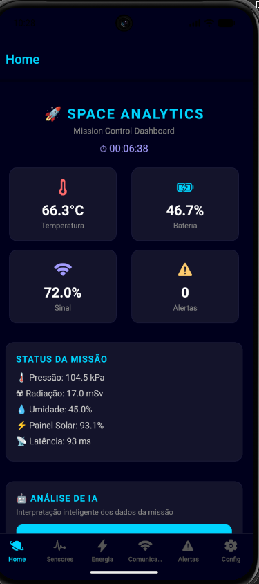
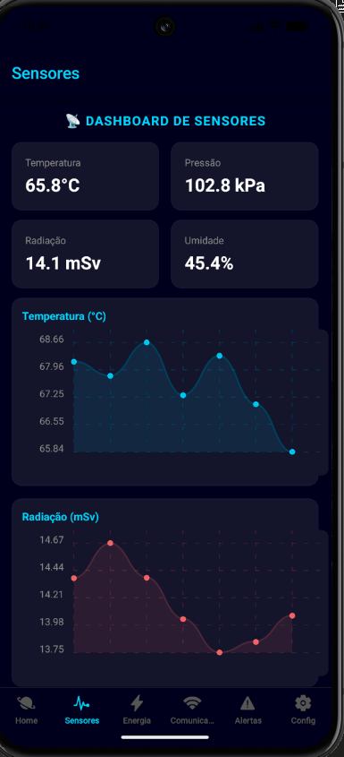
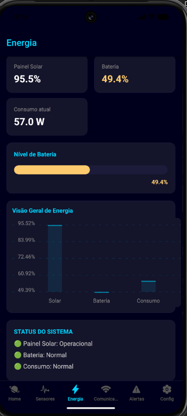
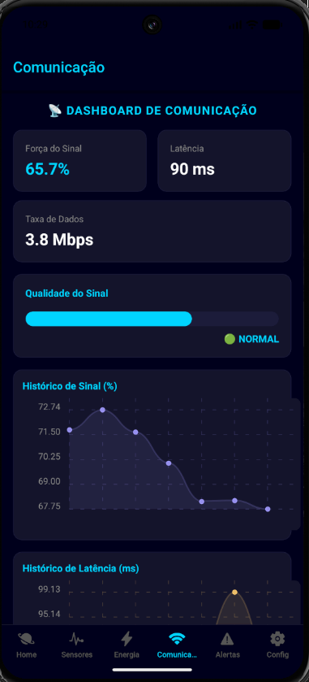
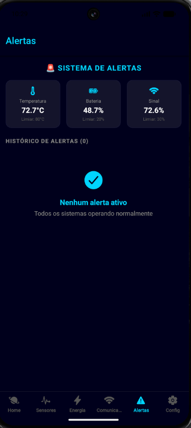
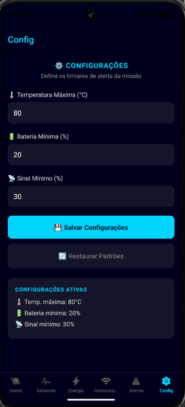

# 🚀 Space Analytics
### Global Solution 2026.1 — Cross-Platform Application Development | FIAP

## Descrição
Space Analytics é uma plataforma mobile inteligente de análise preditiva para monitoramento de sistemas espaciais e operações orbitais simuladas. O app coleta, organiza e processa dados de sensores, energia e comunicação de uma missão simulada, gerando alertas automáticos e relatórios com IA generativa (Groq/Llama). O diferencial da solução é a integração com LLM para interpretação inteligente dos dados em tempo real.

## 👥 Equipe

| Nome | RM |
|------|----|
| Sergio Mirabelo | RM562161 |
| Erick Gimenez | RM564748 |

## 📱 Telas do Aplicativo

### Home — Dashboard Principal


-Visão geral dos indicadores da missão: temperatura, bateria, sinal e alertas ativos. Inclui análise de IA generativa.

### Dashboard de Sensores


-Gráficos em tempo real de temperatura, pressão, radiação e umidade.

### Dashboard de Energia


-Indicadores de painel solar, bateria e consumo com gráfico de barras e barra de nível.

### Dashboard de Comunicação


-Status do link de telemetria, latência e qualidade do sinal com histórico gráfico.

### Alertas


-Lista de alertas gerados automaticamente com base nos limiares configurados.

### Configurações


-Formulário de configuração dos limiares de alerta com validação e persistência via AsyncStorage.

## ✅ Funcionalidades

- [x] Dashboard com indicadores em tempo real (simulado)
- [x] Sistema de alertas automáticos por limiar crítico
- [x] Persistência de configurações com AsyncStorage
- [x] Navegação com Expo Router (Tabs)
- [x] Context API para estado global da missão
- [x] Formulário de configuração com validação
- [x] IA Generativa (Groq/Llama) para interpretação inteligente dos dados

## 🛠 Tecnologias

- React Native + Expo
- Expo Router
- AsyncStorage
- Context API
- TypeScript
- react-native-chart-kit
- Groq API (Llama 3)

## ▶️ Como Executar

### Pré-requisitos
- Node.js instalado
- Expo Go instalado no celular (iOS ou Android)

### Instalação

```bash
git clone https://github.com/sergiomirabelo/space-analytics.git
cd space-analytics
npm install
npx expo start
```

Escaneie o QR Code com o Expo Go para rodar no dispositivo físico.

> ⚠️ Para usar a função de IA, adicione sua chave da [Groq API](https://console.groq.com) no arquivo `components/AIAnalysis.tsx` na linha 35.

## 🎥 Vídeo de Demonstração

[Clique aqui para assistir](https://youtube.com/...)

## 📄 Licença
Este projeto foi desenvolvido para fins acadêmicos — FIAP 2026.
